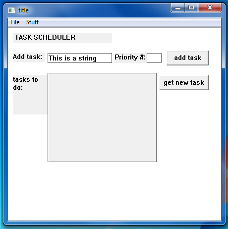

this is supposed to be a sort of checklist-type program that has an underlying min-heap 
to keep the order of various activities inputted by the user based on priority number.    
     
I'm using the Win32 API to create the GUI. currently a work-in-progress.    

The heap is implemented now and appears to work properly. I can add events with their priority number 
and retrieve the nextmost important event, so far as of 3/23/17 ^_^.    
    
6/5/17: wow I'm dumb. I was looking at this program again recently and tested it using data where the nodes inserted had the values 5, 2, 3, 1, 4. For some reason I was expecting all the numbers to be printed in order and kept looking for a bug. unfortunately, if I wanted all the events to be printed in order based on value, I should've gone with a BST I think with inorder traversal. A min-heap doesn't ensure numerical order; it just makes sure all the larger-value nodes stay at the bottom of the heap.    
    
anyway, for completeness, I would like to touch up the UI if possible and maybe make the read-only text window clearable. 
    
currently it looks like this:  
</img>
