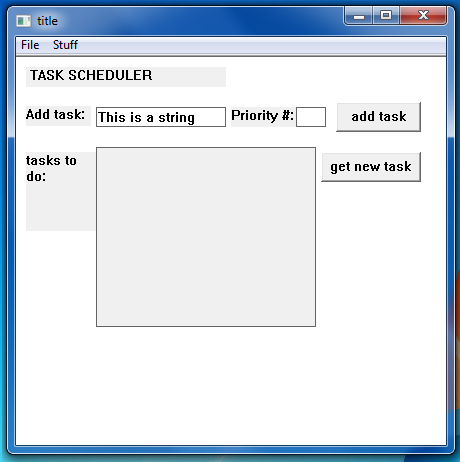

this is supposed to be a sort of checklist-type program that has an underlying min-heap 
to keep the order of various activities inputted by the user based on priority number.    
     
I'm using the Win32 API to create the GUI. currently a work-in-progress.    

The heap is implemented now and appears to work properly. I can add events with their priority number 
and retrieve the nextmost important event, so far as of 3/23/17 ^_^.    
    
currently it looks like this:  
</img>
